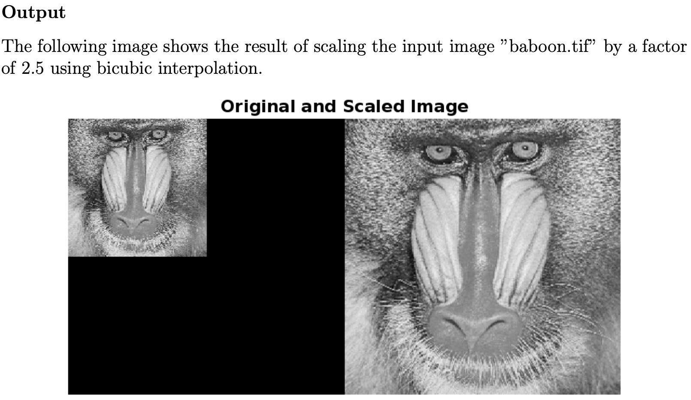

BICUBIC IMAGE RESCALING — NUMERICAL ANALYSIS PROJECT
====================================================

Overview
--------
This project implements bicubic interpolation for grayscale image rescaling in MATLAB.
The approach is based on Catmull-Rom splines and increases the resolution of a given
grayscale image by an integer scaling factor.

Bicubic interpolation provides a smoother and more visually appealing result compared
to bilinear or nearest-neighbor interpolation by considering a 4×4 neighborhood of
pixels around each interpolated point.

Algorithm
---------

Input:
- An n × n grayscale image matrix.
- An integer scaling factor s.

Output:
- A scaled image of size ((n−1)·s + 1) × ((n−1)·s + 1).

Steps:
1. Pad the image with edge values to ensure all 4×4 neighborhoods are valid.
2. For each internal pixel (from 2 to n in both directions):
    a. Extract a 4×4 patch centered around the current pixel.
    b. For i from 1 to s+1 (vertical scaling):
        For j from 1 to s+1 (horizontal scaling):
            i. Compute local coordinates u = (j−1)/s, v = (i−1)/s.
            ii. Perform 1D Catmull-Rom interpolation row-wise to get 4 intermediate values.
            iii. Perform 1D Catmull-Rom interpolation on the result column-wise.
            iv. Assign the interpolated value to the scaled image at the corresponding location.
3. Round the scaled image to the nearest integer.

Catmull-Rom Spline Formula:
s(t) = 0.5 * [2f(0) + (-f(-1) + f(1))·t +
              (2f(-1) - 5f(0) + 4f(1) - f(2))·t² +
              (-f(-1) + 3f(0) - 3f(1) + f(2))·t³]

Code Structure
--------------

Functions:
- interpolateAtT(P0, P1, P2, P3, t): 1D Catmull-Rom interpolation.
- bicubicInterpolate(matrix, u, v): Performs 2D interpolation by two 1D interpolations.
- addPadding(matrix): Adds edge padding to the image.
- bicubicScaling(matrix, s): Main scaling function that builds the scaled image.

Main Script:
- Reads an image, applies bicubic scaling with factor 2, and displays the result side-by-side.

Example Usage in MATLAB:
-------------------------

    inputImage = imread('baboon.tif');  % sample image
    outputImage = bicubicScaling(inputImage, 2);
    imshowpair(inputImage, outputImage, 'montage');
    title('Original and Scaled Image');
    

Author
------
Lokesh Lakshminarayanan  
Pranav P Jagathpathy  
Numerical Analysis Coursework — 2025
